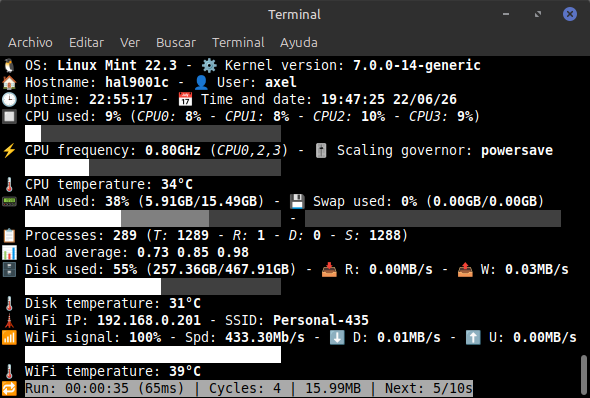
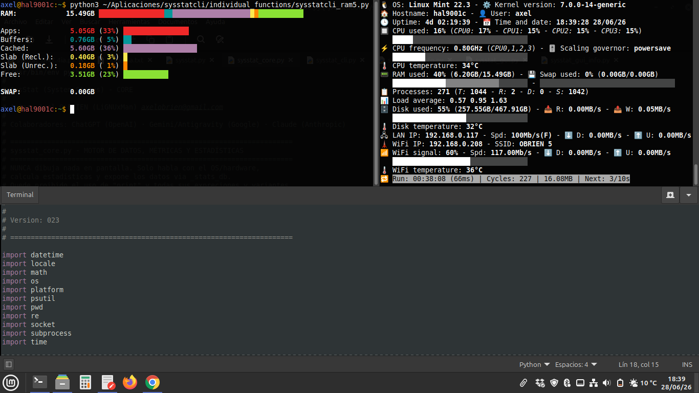
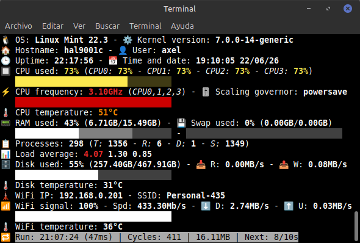
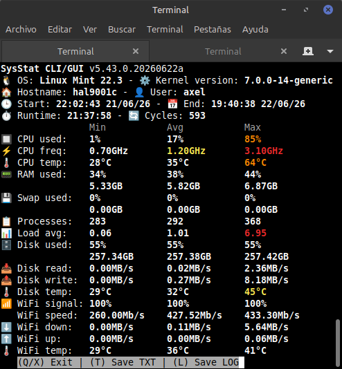

# SysStat (System Status) CLI/GUI v5.46.0.20260708e "Starship"



## 🇺🇸🇬🇧 English

### Description

**SysStat** is a real-time system monitoring tool for Linux, written in pure Python. It evolved from the original single-file **SysStatCLI** into a clean **6-module architecture** that strictly separates data collection (core) from rendering (CLI view / GUI view).

It reports CPU (usage, per-core, frequency, governor, temperature), RAM/Swap, process count, load average, disk usage/I-O/temperature, wired LAN, WiFi (signal, speed, I-O, temperature), and battery — all color-coded by severity, with optional progress bars and a final session report (min/avg/max) you can save to disk.

### 🏗️ Architecture

SysStat is split into 6 files, each with one strict responsibility:

| File                    | Responsibility                                                                 |
| ------------------------ | ------------------------------------------------------------------------------- |
| `sysstat.py`             | Orchestrator — argument parsing, config object, entry point                    |
| `sysstat_core.py`        | **Only** file that talks to the OS/hardware. Computes min/avg/max. Never prints anything |
| `sysstat_cli.py`         | Draws the live CLI interface. Never touches the OS or computes stats directly  |
| `sysstat_cli_info.py`    | Draws the final CLI session report (min/avg/max summary)                       |
| `sysstat_gui.py`         | Draws the GUI interface *(under active development — basic stub for now)*      |
| `sysstat_gui_info.py`    | Draws the final GUI session report *(under active development)*                |

Files communicate **only** through `sysstat_core`'s public API (`get()`, `get_stats()`, `get_count()`, etc.) — no module reaches into another's internal state directly.

> 💡 A fully-featured single-file legacy version (`sysstat_3.47.4ia.py`, including a complete CustomTkinter GUI) is kept in the repo as reference while the GUI is being ported to the modular architecture.

### Features

- **System info**: OS name and kernel version.
- **Host**: hostname and current user.
- **Uptime**: time since boot, current date and time.
- **CPU**: total usage, per-core breakdown (`-cn` to collapse), frequency (GHz) with cores currently at max clock, scaling governor, temperature.
- **RAM / Swap**: usage %, GB used/total, 3-segment bar (apps / cache+buffers / free) for RAM.
- **Processes**: total processes, total threads (T), running (R), blocked/disk-sleep (D) and sleeping (S).
- **Load average**: 1/5/15 min, colored against core count.
- **Disk**: usage % and GB on `/`, read/write speed (MB/s), NVMe and SSD temperature.
- **LAN**: IP, link speed, duplex, down/up throughput. Hot-detected every cycle (works with USB adapters too).
- **WiFi**: IP, SSID, signal %, link speed, down/up throughput, adapter temperature. Hot-detected every cycle.
- **Battery**: percentage, remaining time while discharging, charging state.
- **Progress bars**: independently toggleable per metric.
- **Loop mode**: run every N seconds, indefinitely or for a fixed number of cycles (`-N`).
- **Final report**: on exit, shows min/avg/max for every tracked metric; press **T** to save as `.txt` (clean), **L** to save as `.log` (with ANSI colors), or **P** to save as `.pdf` *(requires `fpdf2`, optional)*.
- **Icon-free mode**: for terminals without Unicode/emoji support (auto-detected).

### 💡 Real-world setup

Pairs great with a drop-down terminal like [Guake](http://guake-project.org/) bound to a hotkey (e.g. F12) — pull up the monitor whenever you need it, without taking up permanent desktop space:



### 📸 Under load

Color thresholds reacting to a real CPU/load spike — same script, same terminal:



```
🐧 OS: Linux Mint 22.3 - ⚙️ Kernel version: 7.0.0-14-generic
💻 Hostname: hal9001c - 🧑 User: axel
🕒 Uptime: 5d 23:49:26 - 📅 Time and date: 09:29:35 09/07/26
🔳 CPU used: 50% (0: 49% - 1: 50% - 2: 50% - 3: 50%)
   ████████████████░░░░░░░░░░░░░░░░
🚀 CPU frequency: 1.60GHz (0,1,2,3) - 🎚️ Scaling governor: powersave
   ████████████████░░░░░░░░░░░░░░░░
🌡️ CPU temperature: 39°C
📟 RAM used: 49% (7.57GB/15.49GB) - 🔀 Swap used: 0% (0.00GB/0.00GB)
   ███████████████▒▒▒▒▒▒▒▒▒▒▒▒▒░░░░ - ░░░░░░░░░░░░░░░░░░░░░░░░░░░░░░░░
📋 Processes: 296 (T: 1500 - R: 2 - D: 0 - S: 1451)
📊 Load average: 1.25 1.10 1.05
🗄️ Disk used: 55% (258.92GB/467.91GB) - 📥 R: 0.00MB/s - 📤 W: 0.17MB/s
   █████████████████░░░░░░░░░░░░░░░
🌡️ Disk temperature: 33°C
🖧 LAN IP: 192.168.0.117 - Spd: 100Mb/s(F) - ⬇️ D: 0.00MB/s - ⬆️ U: 0.00MB/s
🗼 WiFi IP: 192.168.0.208 - SSID: OBRIEN 5
🛜 WiFi signal: 52% - Spd: 117.00Mb/s - ⬇️ D: 0.01MB/s - ⬆️ U: 0.00MB/s
   ████████████████░░░░░░░░░░░░░░░░
🌡️ WiFi temperature: 45°C
🔋 Battery: 86% - Time: 3h 45m - Mode: Discharging
   ████████████████████████████░░░░
🔁 Run: 01:08:56 (58ms) | Cycles: 411 | 18.55MB | Next: 4/10s
```

### 📊 Final report

When the script exits, it prints a min/avg/max summary for the whole session and lets you save it as `.txt`, `.log`, or `.pdf`:

> 📄 PDF export requires `fpdf2` (`pip install fpdf2 --break-system-packages`). If it's not installed, the **(P) Save PDF** option simply doesn't appear — everything else works the same.



```
SysStat CLI/GUI v5.46.0.20260708e Starship
🐧 OS: Linux Mint 22.3 - ⚙️ Kernel version: 7.0.0-14-generic
💻 Hostname: hal9001c - 🧑 User: axel
🕒 Start: 22:02:43 08/07/26 - 📅 End: 19:40:38 09/07/26
⏱️ Runtime: 21:37:58 - 🔄 Cycles: 593
                Min           Avg           Max
🔳 CPU used:    1%            17%           85%
🚀 CPU freq:    0.70GHz       1.20GHz       3.10GHz
🌡️ CPU temp:    28°C          35°C          64°C
📟 RAM used:    34%           38%           44%
                5.33GB        5.82GB        6.87GB
🔀 Swap used:   0%            0%            0%
                0.00GB        0.00GB        0.00GB
📋 Processes:   283           292           368
📊 Load avg:    0.06          1.01          6.95
🗄️ Disk used:   55%           55%           55%
                257.34GB      257.38GB      257.42GB
📥 Disk read:   0.00MB/s      0.02MB/s      2.36MB/s
📤 Disk write:  0.00MB/s      0.27MB/s      8.18MB/s
🌡️ Disk temp:   29°C          32°C          45°C
🖧 Lan speed:   100Mb/s       100.0Mb/s     100Mb/s
⬇️ Lan down:    0.00MB/s      0.03MB/s      1.09MB/s
⬆️ Lan up:      0.00MB/s      0.00MB/s      0.05MB/s
🛜 WiFi signal: 100%          100%          100%
   WiFi speed:  260.00Mb/s    427.52Mb/s    433.30Mb/s
⬇️ WiFi down:   0.00MB/s      0.11MB/s      5.64MB/s
⬆️ WiFi up:     0.00MB/s      0.00MB/s      0.06MB/s
🌡️ WiFi temp:   29°C          36°C          41°C
🔋 Battery:     54%           78%           100%
```

**Sample reports:** [.txt](sysstat_reports/sysstat_20260617_202726.txt) · [.log](sysstat_reports/sysstat_20260617_202726.log) · [.pdf](sysstat_reports/sysstat_20260617_202726.pdf)

### Installation

**Requirements:**
- Python 3.x
- Linux with `psutil`, `/proc`, `/sys` (standard on virtually any distro)
- `iw` installed for WiFi SSID/signal detection
- *(GUI mode, in progress)*: `customtkinter`

```bash
pip install psutil
git clone https://github.com/LiGNUxMan/SysStat.git
cd SysStat
python3 sysstat.py
```

**Optional — PDF report export:**

```bash
pip install fpdf2 --break-system-packages
```

### Usage

```bash
python3 sysstat.py [interval] [-cycles] [options]
```

- `interval`: seconds between refreshes. Omitted or `0` → runs once.
- `-cycles`: number with a dash (e.g. `-10`) → run exactly that many times.
- Press **Q** or **X** during execution to exit early.

#### Available options

| Section    | Flags                    | Description                          |
| ---------- | ------------------------ | ------------------------------------- |
| System     | `-s`, `-sys`             | Skip OS name and kernel version       |
| Host       | `-o`, `-host`            | Skip hostname and user                |
| Uptime     | `-u`, `-up`              | Skip uptime/date/time                 |
| CPU        | `-c`, `-cpu`             | Skip usage, frequency, temperature    |
| CPU cores  | `-cn`, `-cpun`           | Hide per-core breakdown               |
| RAM        | `-r`, `-ram`             | Skip RAM/Swap                         |
| Processes  | `-p`, `-proc`            | Skip process count                    |
| Load       | `-l`, `-load`            | Skip load average                     |
| Disk       | `-d`, `-disk`            | Skip disk usage/temperature           |
| LAN        | `-a`, `-lan`             | Skip wired network                    |
| WiFi       | `-w`, `-wifi`            | Skip WiFi                             |
| Battery    | `-t`, `-bat`             | Skip battery                          |
| Bars       | `-b`, `-bar`             | Hide **all** progress bars            |
|            | `-bc`, `-barc`           | Hide CPU usage bar                    |
|            | `-bf`, `-barf`           | Hide CPU frequency bar                |
|            | `-br`, `-barr`           | Hide RAM bar                          |
|            | `-bd`, `-bard`           | Hide Disk bar                         |
|            | `-bw`, `-barw`           | Hide WiFi bar                         |
|            | `-bt`, `-bart`           | Hide Battery bar                      |
| Icons      | `-i`, `-icon`            | Hide decorative icons                 |
| GUI        | `-g`, `-gui`             | Start in graphical mode *(not available yet)* |
| Help       | `-h`, `-help`, `--help`  | Show help and exit                    |

#### Examples

```bash
python3 sysstat.py                # Run once, show everything
python3 sysstat.py 30             # Loop every 30 seconds
python3 sysstat.py -r -w          # Run once, skip RAM and WiFi
python3 sysstat.py -s -b 10       # Loop every 10s, skip system info and all bars
python3 sysstat.py -g 15 -100     # GUI mode, every 15s, for 100 cycles
```

### 🎨 Adjusting thresholds to your hardware

All thresholds live in **one place**: `get_metric_color()` in `sysstat_core.py`. Defaults:

| Metric          | Normal (⚪)   | Warning (🟡)  | High (🟠)     | Critical (🔴) |
| --------------- | ------------- | ------------- | ------------- | -------------- |
| CPU usage       | < 40%         | 40–74%        | 75–89%        | ≥ 90%          |
| CPU frequency % | ≤ 25.9%       | 26.0–80.6%    | 80.7–99.9%    | 100%           |
| CPU temp        | < 37°C        | 37–49°C       | 50–69°C       | ≥ 70°C         |
| RAM / Swap      | < 50%         | 50–74%        | 75–89%        | ≥ 90%          |
| Load average    | < 70% cores   | 70–85%        | 85–100%       | > 100%         |
| Disk usage      | < 70%         | 70–79%        | 80–89%        | ≥ 90%          |
| Disk temp       | < 45°C        | 45–54°C       | 55–64°C       | ≥ 65°C         |
| WiFi signal     | ≥ 60%         | 40–59%        | 20–39%        | < 20%          |
| WiFi temp       | < 50°C        | 50–59°C       | 60–69°C       | ≥ 70°C         |
| Battery         | > 50%         | 30–50%        | 15–30%        | ≤ 15%          |

If your hardware behaves differently, edit the values in that single function — no other file needs to change.

### Contributing

Improvements, fixes, and suggestions are welcome — open an issue or a pull request.

### Roadmap

- [ ] Port the full CustomTkinter GUI to the new modular architecture
- [ ] Audible alert when a critical metric goes red
- [ ] Graphing historical data from saved `.log` reports

### Author

- **Axel O'BRIEN (LiGNUxMan)** — [GitHub](https://github.com/LiGNUxMan)
- **Development support**: ChatGPT (OpenAI) · Gemini/Antigravity (Google) · Claude (Anthropic)

### License

Distributed under **GPLv3**. Use it, modify it, share it.
> Made with 💚 and a passion for free software.

---


## 🇪🇸 Español

### Descripción

**SysStat** es una herramienta de monitoreo del sistema en tiempo real para Linux, escrita en Python puro. Evolucionó desde el script único original **SysStatCLI** hacia una **arquitectura modular de 6 archivos** que separa estrictamente la recolección de datos (core) de la visualización (vista CLI / vista GUI).

Reporta CPU (uso, por núcleo, frecuencia, governor, temperatura), RAM/Swap, procesos, carga del sistema, disco (uso/I-O/temperatura), LAN cableada, WiFi (señal, velocidad, I-O, temperatura) y batería — todo coloreado por severidad, con barras de progreso opcionales y un informe final de sesión (min/avg/max) que se puede guardar en disco.

### 🏗️ Arquitectura

SysStat está dividido en 6 archivos, cada uno con una única responsabilidad:

| Archivo                  | Responsabilidad                                                                  |
| ------------------------- | ---------------------------------------------------------------------------------- |
| `sysstat.py`              | Orquestador — parseo de argumentos, configuración, punto de entrada               |
| `sysstat_core.py`         | **Único** archivo que habla con el OS/hardware. Calcula min/avg/max. Nunca dibuja nada |
| `sysstat_cli.py`          | Dibuja la interfaz CLI en vivo. Nunca toca el OS ni calcula estadísticas           |
| `sysstat_cli_info.py`     | Dibuja el informe final de la sesión CLI (resumen min/avg/max)                    |
| `sysstat_gui.py`          | Dibuja la interfaz GUI *(en desarrollo activo — placeholder básico por ahora)*     |
| `sysstat_gui_info.py`     | Dibuja el informe final de la sesión GUI *(en desarrollo activo)*                  |

Los archivos se comunican **únicamente** a través de la API pública de `sysstat_core` (`get()`, `get_stats()`, `get_count()`, etc.) — ningún módulo accede directamente al estado interno de otro.

> 💡 Se conserva en el repo una versión legacy de archivo único (`sysstat_3.47.4ia.py`, con GUI completa en CustomTkinter) como referencia mientras se porta la GUI a la arquitectura modular.

### Características

- **Sistema**: nombre del SO y versión del kernel.
- **Host**: hostname y usuario actual.
- **Uptime**: tiempo desde el arranque, fecha/hora actual.
- **CPU**: uso total, detalle por núcleo (`-cn` para colapsarlo), frecuencia (GHz) con los núcleos que están al máximo, scaling governor, temperatura.
- **RAM / Swap**: % de uso, GB usados/totales, barra de 3 segmentos (apps / caché+buffers / libre) para RAM.
- **Procesos**: total de procesos, total de hilos (T), en ejecución (R), bloqueados (disk-sleep) (D) y durmiendo (S).
- **Carga del sistema**: 1/5/15 min, coloreada según cantidad de núcleos.
- **Disco**: % y GB usados en `/`, velocidad de lectura/escritura (MB/s), temperatura NVMe y SSD.
- **LAN**: IP, velocidad de enlace, dúplex, throughput de bajada/subida. Detección en caliente en cada ciclo (funciona también con adaptadores USB).
- **WiFi**: IP, SSID, % de señal, velocidad, throughput de bajada/subida, temperatura de la placa. Detección en caliente en cada ciclo.
- **Batería**: porcentaje, tiempo restante mientras descarga, estado de carga.
- **Barras de progreso**: activables/desactivables de forma independiente por métrica.
- **Modo bucle**: ejecuta cada N segundos, indefinidamente o por una cantidad fija de ciclos (`-N`).
- **Informe final**: al salir, muestra min/avg/max de cada métrica registrada; presioná **T** para guardar como `.txt` (limpio), **L** para guardar como `.log` (con colores ANSI), o **P** para guardar como `.pdf` *(requiere `fpdf2`, opcional)*.
- **Modo sin íconos**: para terminales sin soporte Unicode/emoji (detección automática).

### 💡 Uso en el día a día

Combina genial con una terminal desplegable como [Guake](http://guake-project.org/) atada a una tecla rápida (ej. F12) — invocás el monitor cuando lo necesitás, sin ocupar espacio fijo de escritorio:


### 📸 Bajo carga

Los umbrales de color reaccionando a un pico real de CPU/carga — mismo script, misma terminal:


```
🐧 OS: Linux Mint 22.3 - ⚙️ Kernel version: 7.0.0-14-generic
💻 Hostname: hal9001c - 🧑 User: axel
🕒 Uptime: 5d 23:49:26 - 📅 Time and date: 09:29:35 09/07/26
🔳 CPU used: 50% (0: 49% - 1: 50% - 2: 50% - 3: 50%)
   ████████████████░░░░░░░░░░░░░░░░
🚀 CPU frequency: 1.60GHz (0,1,2,3) - 🎚️ Scaling governor: powersave
   ████████████████░░░░░░░░░░░░░░░░
🌡️ CPU temperature: 39°C
📟 RAM used: 49% (7.57GB/15.49GB) - 🔀 Swap used: 0% (0.00GB/0.00GB)
   ███████████████▒▒▒▒▒▒▒▒▒▒▒▒▒░░░░ - ░░░░░░░░░░░░░░░░░░░░░░░░░░░░░░░░
📋 Processes: 296 (T: 1500 - R: 2 - D: 0 - S: 1451)
📊 Load average: 1.25 1.10 1.05
🗄️ Disk used: 55% (258.92GB/467.91GB) - 📥 R: 0.00MB/s - 📤 W: 0.17MB/s
   █████████████████░░░░░░░░░░░░░░░
🌡️ Disk temperature: 33°C
🖧 LAN IP: 192.168.0.117 - Spd: 100Mb/s(F) - ⬇️ D: 0.00MB/s - ⬆️ U: 0.00MB/s
🗼 WiFi IP: 192.168.0.208 - SSID: OBRIEN 5
🛜 WiFi signal: 52% - Spd: 117.00Mb/s - ⬇️ D: 0.01MB/s - ⬆️ U: 0.00MB/s
   ████████████████░░░░░░░░░░░░░░░░
🌡️ WiFi temperature: 45°C
🔋 Battery: 86% - Time: 3h 45m - Mode: Discharging
   ████████████████████████████░░░░
🔁 Run: 01:08:56 (58ms) | Cycles: 411 | 18.55MB | Next: 4/10s
```

### 📊 Informe final

Al salir del script, imprime un resumen min/avg/max de toda la sesión y te deja guardarlo como `.txt`, `.log` o `.pdf`:

> 📄 Exportar a PDF requiere `fpdf2` (`pip install fpdf2 --break-system-packages`). Si no está instalado, la opción **(P) Save PDF** simplemente no aparece — el resto funciona igual.


```
SysStat CLI/GUI v5.46.0.20260708e Starship
🐧 OS: Linux Mint 22.3 - ⚙️ Kernel version: 7.0.0-14-generic
💻 Hostname: hal9001c - 🧑 User: axel
🕒 Start: 22:02:43 08/07/26 - 📅 End: 19:40:38 09/07/26
⏱️ Runtime: 21:37:58 - 🔄 Cycles: 593
                Min           Avg           Max
🔳 CPU used:    1%            17%           85%
🚀 CPU freq:    0.70GHz       1.20GHz       3.10GHz
🌡️ CPU temp:    28°C          35°C          64°C
📟 RAM used:    34%           38%           44%
                5.33GB        5.82GB        6.87GB
🔀 Swap used:   0%            0%            0%
                0.00GB        0.00GB        0.00GB
📋 Processes:   283           292           368
📊 Load avg:    0.06          1.01          6.95
🗄️ Disk used:   55%           55%           55%
                257.34GB      257.38GB      257.42GB
📥 Disk read:   0.00MB/s      0.02MB/s      2.36MB/s
📤 Disk write:  0.00MB/s      0.27MB/s      8.18MB/s
🌡️ Disk temp:   29°C          32°C          45°C
🖧 Lan speed:   100Mb/s       100.0Mb/s     100Mb/s
⬇️ Lan down:    0.00MB/s      0.03MB/s      1.09MB/s
⬆️ Lan up:      0.00MB/s      0.00MB/s      0.05MB/s
🛜 WiFi signal: 100%          100%          100%
   WiFi speed:  260.00Mb/s    427.52Mb/s    433.30Mb/s
⬇️ WiFi down:   0.00MB/s      0.11MB/s      5.64MB/s
⬆️ WiFi up:     0.00MB/s      0.00MB/s      0.06MB/s
🌡️ WiFi temp:   29°C          36°C          41°C
🔋 Battery:     54%           78%           100%
```

**Informes de ejemplo:** [.txt](sysstat_reports/sysstat_20260617_202726.txt) · [.log](sysstat_reports/sysstat_20260617_202726.log) · [.pdf](sysstat_reports/sysstat_20260617_202726.pdf)

### Instalación

**Requisitos:**
- Python 3.x
- Linux con `psutil`, `/proc`, `/sys` (estándar en prácticamente cualquier distro)
- `iw` instalado para detectar SSID/señal de WiFi
- *(modo GUI, en desarrollo)*: `customtkinter`

```bash
pip install psutil
git clone https://github.com/LiGNUxMan/SysStat.git
cd SysStat
python3 sysstat.py
```

**Opcional — exportar informes a PDF:**

```bash
pip install fpdf2 --break-system-packages
```

### Uso

```bash
python3 sysstat.py [intervalo] [-ciclos] [opciones]
```

- `intervalo`: segundos entre actualizaciones. Omitido o `0` → se ejecuta una sola vez.
- `-ciclos`: número con guion (ej. `-10`) → se ejecuta exactamente esa cantidad de veces.
- Presioná **Q** o **X** durante la ejecución para salir antes de tiempo.

#### Opciones disponibles

| Sección    | Flags                    | Descripción                            |
| ---------- | ------------------------ | --------------------------------------- |
| Sistema    | `-s`, `-sys`             | Omite nombre del SO y versión de kernel |
| Host       | `-o`, `-host`            | Omite hostname y usuario                |
| Uptime     | `-u`, `-up`              | Omite uptime/fecha/hora                 |
| CPU        | `-c`, `-cpu`             | Omite uso, frecuencia, temperatura      |
| Núcleos    | `-cn`, `-cpun`           | Oculta el detalle por núcleo            |
| RAM        | `-r`, `-ram`             | Omite RAM/Swap                         |
| Procesos   | `-p`, `-proc`            | Omite conteo de procesos                |
| Carga      | `-l`, `-load`            | Omite carga del sistema                 |
| Disco      | `-d`, `-disk`            | Omite uso/temperatura del disco         |
| LAN        | `-a`, `-lan`             | Omite red cableada                      |
| WiFi       | `-w`, `-wifi`            | Omite WiFi                             |
| Batería    | `-t`, `-bat`             | Omite batería                          |
| Barras     | `-b`, `-bar`             | Oculta **todas** las barras             |
|            | `-bc`, `-barc`           | Oculta barra de uso de CPU              |
|            | `-bf`, `-barf`           | Oculta barra de frecuencia de CPU       |
|            | `-br`, `-barr`           | Oculta barra de RAM                     |
|            | `-bd`, `-bard`           | Oculta barra de Disco                   |
|            | `-bw`, `-barw`           | Oculta barra de WiFi                    |
|            | `-bt`, `-bart`           | Oculta barra de Batería                 |
| Íconos     | `-i`, `-icon`            | Oculta íconos decorativos               |
| GUI        | `-g`, `-gui`             | Arranca en modo gráfico *(no disponible aún)* |
| Ayuda      | `-h`, `-help`, `--help`  | Muestra la ayuda y sale                 |

#### Ejemplos

```bash
python3 sysstat.py                # Ejecuta una vez, muestra todo
python3 sysstat.py 30             # Bucle cada 30 segundos
python3 sysstat.py -r -w          # Una sola vez, omitiendo RAM y WiFi
python3 sysstat.py -s -b 10       # Bucle cada 10s, sin datos de sistema ni barras
python3 sysstat.py -g 15 -100     # Modo GUI, cada 15s, durante 100 ciclos
```

### 🎨 Ajustar los umbrales a tu hardware

Todos los umbrales viven en **un solo lugar**: `get_metric_color()` en `sysstat_core.py`. Valores por defecto:

| Métrica           | Normal (⚪)   | Atención (🟡) | Alto (🟠)     | Crítico (🔴) |
| ------------------ | ------------- | ------------- | ------------- | -------------- |
| Uso de CPU          | < 40%         | 40–74%        | 75–89%        | ≥ 90%          |
| Frecuencia CPU %    | ≤ 25,9%       | 26,0–80,6%    | 80,7–99,9%    | 100%           |
| Temp. CPU           | < 37°C        | 37–49°C       | 50–69°C       | ≥ 70°C         |
| RAM / Swap          | < 50%         | 50–74%        | 75–89%        | ≥ 90%          |
| Carga del sistema   | < 70% núcleos | 70–85%        | 85–100%       | > 100%         |
| Uso de disco        | < 70%         | 70–79%        | 80–89%        | ≥ 90%          |
| Temp. disco         | < 45°C        | 45–54°C       | 55–64°C       | ≥ 65°C         |
| Señal WiFi          | ≥ 60%         | 40–59%        | 20–39%        | < 20%          |
| Temp. WiFi          | < 50°C        | 50–59°C       | 60–69°C       | ≥ 70°C         |
| Batería             | > 50%         | 30–50%        | 15–30%        | ≤ 15%          |

Si tu hardware se comporta distinto, editá los valores en esa única función — ningún otro archivo necesita cambiar.

### Contribuciones

Mejoras, correcciones o sugerencias son bienvenidas — abrí un issue o un pull request.

### Roadmap

- [ ] Portar la GUI completa de CustomTkinter a la arquitectura modular
- [ ] Alerta sonora cuando una métrica crítica esté en rojo
- [ ] Gráficos históricos a partir de los `.log` guardados

### Autor

- **Axel O'BRIEN (LiGNUxMan)** — [GitHub](https://github.com/LiGNUxMan)
- **Asistencia en desarrollo**: ChatGPT (OpenAI) · Gemini/Antigravity (Google) · Claude (Anthropic)

### Licencia

Distribuido bajo **GPLv3**. ¡Usalo, modificalo y compartilo!
> Hecho con 💚 y pasión por el software libre.
